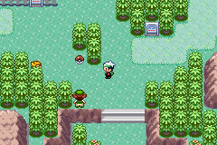

# Contents
- [Contents](#contents)
- [Motivation](#motivation)
- [The What](#the-what)
- [Scope](#scope)
- [The How](#the-how)
  - [EventSnippets](#eventsnippets)
  - [TrainerBattleParameter](#trainerbattleparameter)
  - [Script Building](#script-building)
- [Using the framework](#using-the-framework)
    - [1. Adding a new Snippet](#1-adding-a-new-snippet)
    - [2. Inserting the Snippet](#2-inserting-the-snippet)

# Motivation
In ~~vanilla~~ pokeemerald-expanded there are a few different trainer battle types such as single, double or rematch battles. Each battle type may also have small variations like continuing a script after the battle, playing the battle music or not showing the intro text for the opponent. Unfortunately each of these variation is defined as their own static battle type in the battle engine leading to:
```
TRAINER_BATTLE_SINGLE
TRAINER_BATTLE_CONTINUE_SCRIPT_NO_MUSIC
TRAINER_BATTLE_CONTINUE_SCRIPT
TRAINER_BATTLE_SINGLE_NO_INTRO_TEXT
```
and so on (see [here](https://github.com/rh-hideout/pokeemerald-expansion/blob/c3b0f4dd7f75af3394535651c25f7bf861549eb9/include/constants/battle_setup.h#L4-L17)). It is apparent that with this system it is not possible to have a single battle without music and no intro text, which continues a script. At least not without defining a new battle type (and writing all the required setup code for it). This is fine for few battle types with known variations but leads to a quick explosion in complexity when adding new battle types and variations. 
To solve this problem this PR attempts to provide a framework that may dynamically builds the trainer battle event script, depending on the provided parameters in the [`trainerbattle`](https://github.com/u8-Salem/pokeemerald/blob/9753c60c963ce306fae5c8c321280e99eaf409f0/asm/macros/event.inc#L687-L707) macro. In other words: the previously statically defined battle types are *inferred* by the parameters given. Additionally the framework should be easy to understand and expand, providing users with the ability to create entirely new **variations** quickly. To illustrate what is easily possible with this system here some examples:

- display a victory message after battle for some trainers
- make the player run in a circle after being spotted by an opponent
- opponents take a step backwards after showing their intro text

Lastly this PR attempts to make trainer battle parameters more easily accessible and mutable. This means even after triggering a battle it should be possible to change any of the parameters from outside the initial `trainerbattle` macro.

# The What
To achieve this goal this PR makes **2** fundamental changes. 
1. Dynamically "build" the trainer battle script by pushing script **Snippets** on the global Script Stack when the relevant parameter is provided. To run the finished script, cascade down the stack by running each snippet sequentially.
2. Consolidate (almost) all relevant trainer battle parameters into a struct that lives in **EWRAM**. When reading parameters from a `trainerbattle` macro these are stored in this struct and may be mutated and accessed from anywhere.

These changes are accompanied by several smaller changes that are outlined a bit in the next section.

# Scope
Since this is a very intrusive change it is to be expected that several issues arise from this down the line. To limit the impact and make this PR easier to digest trainer battles are separated into the following **groups**:
- normal trainer battles (single/doubles/approaching)
- multi trainer battles (single/double/*wild*)
- facility trainer battles (trainer hill, battle facilities)
- special trainer battles (e-reader/secret base)

The scope of this PR is then:
- provide the script building framework
- provide the battle parameter struct
- adjust **ALL** battle groups to use the battle parameter struct
- change **only** normal trainer battles to use the script building framework
- make necessary changes to **other** groups to decouple them from normal trainer battles (i.e. trainer hill using `trainerbattle` macro)

# The How
## EventSnippets
To build the trainer battle script, the individual parts must be provided as [`EventSnippets`](https://github.com/u8-Salem/pokeemerald/blob/e431236a9469fc5c7e47e1dd6e92b7fe8a249493/include/event_scripts.h#L42-L55). `EventSnippets` are no different from normal `EventScripts` but they must end with **`return`** if other scripts are meant to be executed after it. A snippet should contain no more than a single "action", like showing the intro text or play the encounter music. 

## TrainerBattleParameter
The [`TrainerBattleParameter`](https://github.com/u8-Salem/pokeemerald/blob/e431236a9469fc5c7e47e1dd6e92b7fe8a249493/include/battle_setup.h#L20-L43) union lives in **ERWAM** as [`gTrainerBattleParameter`](https://github.com/u8-Salem/pokeemerald/blob/e431236a9469fc5c7e47e1dd6e92b7fe8a249493/src/battle_setup.c#L83). For easier access to the struct that holds the data the macro [`TRAINER_BATTLE_PARAM`](https://github.com/u8-Salem/pokeemerald/blob/e431236a9469fc5c7e47e1dd6e92b7fe8a249493/include/battle_setup.h#L73) is provided. `trainerbattle` requires **ALL** parameters to be provided. Parameters that are not used must be **`0`** (or an alias such as `NULL, OBJ_ID_NONE, TRAINER_NONE`). 
`ScrCmd_trainerbattle` will first copy all parameters over to `gTrainerBattleParameter`. 

## Script Building
After the `gTrainerBattleParameter`was initialized with the parameters the scripts is build in [`BattleSetup_ConfigureTrainerBattle`](https://github.com/u8-Salem/pokeemerald/blob/e431236a9469fc5c7e47e1dd6e92b7fe8a249493/src/battle_setup.c#L1089). Here, changes to battle parameters can be made like
```C
if (TRAINER_BATTLE_PARAM.isRematch)
{
    TRAINER_BATTLE_PARAM.battleOpponentA = GetRematchTrainerId(TRAINER_BATTLE_PARAM.battleOpponentA);
}
```

or Snippets may be pushed onto the stack. 

```C
if (TRAINER_BATTLE_PARAM.playMusicA)
{
    PUSH(EventSnippet_PlayTrainerEncounterMusic);
}
```

# Using the framework

Lets demonstrate how to use the framework by adding a simple message before a trainer battle starts like this \


### 1. Adding a new Snippet

First we must create a new `EventSnippet` that does the action we want. In this case its a simple `msgbox` but it may be whatever you want.
```
EventSnippet_PlayerSeen::
	msgbox EventSnippet_Text_GetReady, MSGBOX_AUTOCLOSE
	waitmessage
	return

EventSnippet_Text_GetReady:
	.string "I was seen!\l"
	.string "Lets get ready to fight.$"
```
in `event_scripts.h`: 
```
extern const u8 EventSnippet_PlayerSeen[];
```

### 2. Inserting the Snippet
Now we need to push our Snippet onto the Stack at the right time.
Since I want this only to apply for **approaching** trainers I add **`PUSH(EventSnippet_PlayerSeen)`** to `BattleSetup_ConfigureTrainerBattleApproachingTrainer` in `battle_setup.c`:
```C
const u8 *BattleSetup_ConfigureTrainerBattleApproachingTrainer(const u8* data, PtrStack *scrStack)
{
    if (TRAINER_BATTLE_PARAM.playMusicA)
    {
        PUSH(EventSnippet_PlayTrainerEncounterMusic);
    }

    PUSH(EventSnippet_PlayerSeen);
    PUSH(EventSnippet_TrainerApproach);

    if (TRAINER_BATTLE_PARAM.introTextA != NULL) 
    {
        PUSH(EventSnippet_ShowTrainerIntroMsg);
    }
    ...
}
```
The order in which snippets are pushed onto the stack is important here. I want my message to show **before** the trainers approach, so I need to push it before `PUSH(EventSnippet_TrainerApproach)`.